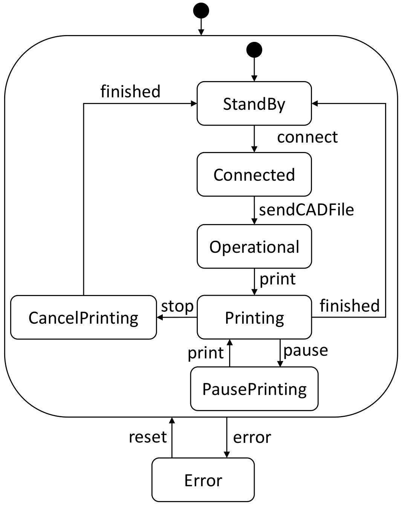
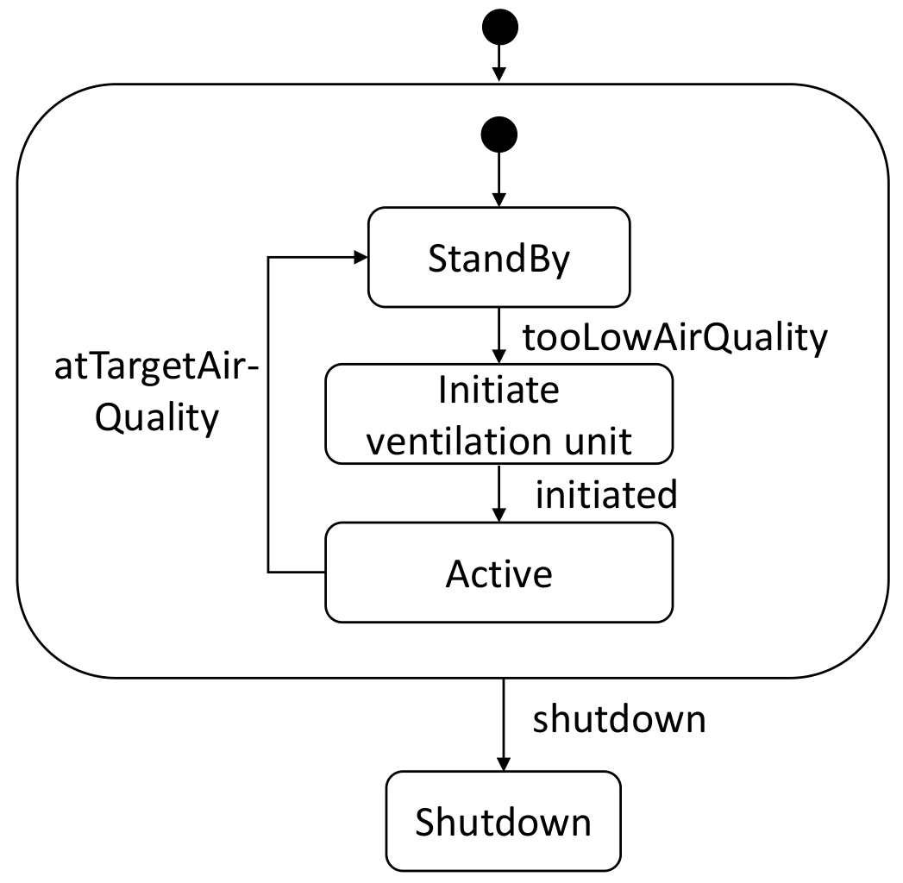

# A Pattern Catalogue for Extending Digital Twin Platforms with Behavioral Models

This repository contains artifacts and evaluation data related to the submission "A Pattern Catalogue for Extending Digital Twin
Platforms with Behavioral Models" submitted to the Journal "Automatisierungstechnik". Therein we point out the current lack of support for modeling concepts for explicating behavioral aspects in Digital Twin Platforms (although such support is given in modeling frameworks such as the Eclipse Modeling Framework (EMF)). Related Digital Twin Modeling Languages (DTML) mostly support structural modeling of systems like Cyber-Physical Production Systems, but neglect the behavior of an object. Therefore we proposed several patterns to enhance DTML models to support explicit behavior modeling, and a snapshot-based approach to trace object states over time in histories, without requiring an extension of the DTML itself. Moreover, we discuss advantages and limitations of the patterns while demonstrating them on the Azure Digital Twin Definition Language (DTDL). 

In this repository, we collected example models that apply these different patterns to a running example described in the paper.

The artifacts are deposited as follows:
- The models which show a realization of the use cases based on the 4-layer architecture in EMF:
	- For both use cases: **[BehaviouralDTP/4_layer_modeling](BehaviouralDTP/4_layer_modeling)**

- The models which show the application of the open and closed system behavior pattern within EMF:
  - Using temporal annotations -> **[BehaviouralDTP/3_layer_modeling_TS](BehaviouralDTP/3_layer_modeling_TS)**
  - Using the snapshot-based pattern -> **[BehaviouralDTP/3_layer_modeling_Snapshot](BehaviouralDTP/3_layer_modeling_Snapshot)**
  
- The corresponding DTDL models that can be imported into the Azure Digital Twins plattform for both the open and closed behavior pattern in combination with the temporal annotation based history patterns:
	- For the 3D printer use case: **[BehaviouralDTP/DTDL_interfaces/3DPrinter](BehaviouralDTP/DTDL_interfaces/3DPrinter)**
	- For the AirQuality use case: **[BehaviouralDTP/DTDL_interfaces/AirQuality](BehaviouralDTP/DTDL_interfaces/AirQuality)**

The behavior models for the use cases are depicted as state diagrams as follows:
<table><tr>
<td>  <em>3D printer use case</em></td>
<td>   <em>AirQuality use case</em></td>
</tr></table>